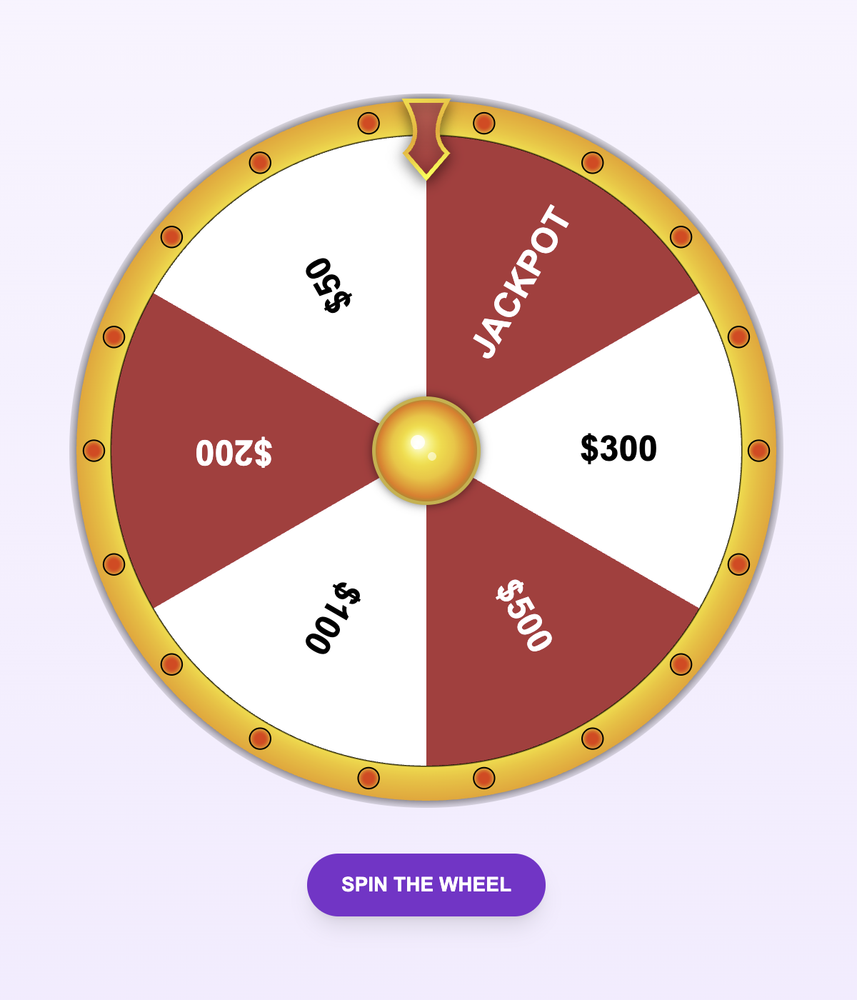
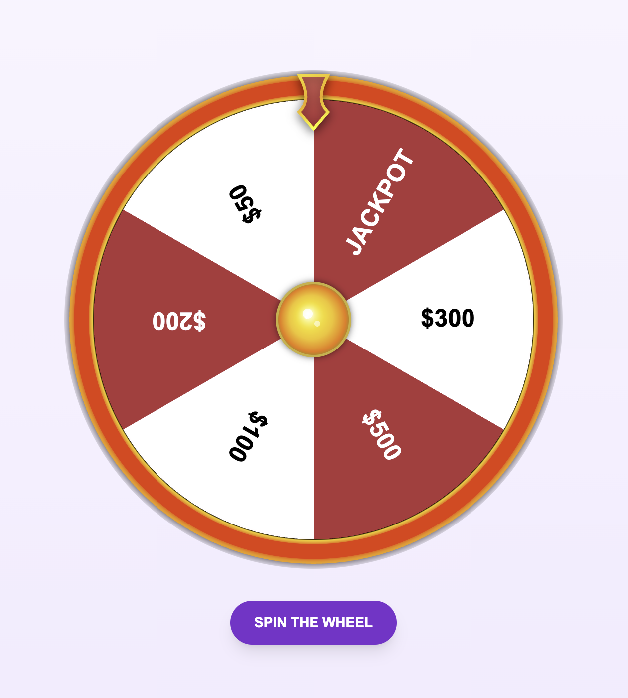

# Wheel of Fortune

<div align="center">
    <table style="border: none" align="center">
        <tr>
            <td style="padding:10px" align="center">
                
    <div>Light Bulbs</div>
            </td>
            <td style="padding:10px" align="center">
                
    <div>Strip Light</div>
            </td>
        </tr>
    </table>
</div>


A customizable **Wheel of Fortune** component built with React, Typescript and Tailwindcss.  

## Features

- Customizable spin and reset durations
- Adjustable spin speed
- Fully customizable segment, border, arrow, and light colors (including gradients)
- Supports two visual light modes: traditional blinking bulbs and continuous strip lighting
- Optional blinking animation for the arrow indicator
- Configurable number of lights and light blink intervals
- Custom font family and font size support for segment labels
- Easily apply custom styles and class names via `styles` and `className` props
- Supports sound effects for both spin and reset actions


## Installation


```bash
npm install @armin-eslami/wheel-of-fortune
```

## Example Usage

```ts
const segments: WheelSegment[] = [
  { id: 1, title: "$500", color: "#C41E3A", textColor: "#FFFFFF" },
  { id: 2, title: "$100", color: "#FFFFFF", textColor: "#000000" },
  // Add more segments here
];

function App() {
  const [spinning, setSpinning] = useState(false);
  const [resetting, setResetting] = useState<boolean>(false);
  const [targetSegmentId, setTargetSegmentId] = useState<number | undefined>();

  const spinWheel = () => {
    if (spinning || resetting) return;
    // Replace with real logic to choose which segment the wheel should stop on.
    const targetId = Math.floor(Math.random() * segments.length) + 1;
    setTargetSegementId(targetId);
    setSpinning(true);
  };

  const onStop = () => {
    setSpinning(false);
  }

  return (
    <main className="flex min-h-screen flex-col items-center justify-center p-4">
      <WheelOfFortune
        classNames="min-w-fit max-w-[500px]"
        segments={segments}
        spinning={spinning}
        targetSegementId={targetSegmentId}
        onStop={onStop}
        onReset={setResetting}
      />
      <button onClick={spinWheel}>
        Spin the Wheel
      </button>
    </main>
  );
}

export default App;
```

## Props

| Name                    | Required | Description                                                                                     | Default                                                                                         |
|-------------------------|----------|-------------------------------------------------------------------------------------------------|------------------------------------------------------------------------------------------------|
| `segments`              | Yes      | Array of wheel segments (`WheelSegment[]`)                                                     | —                                                                                              |
| `spinning`              | Yes      | Boolean to control if the wheel is currently spinning.                                        | —                                                                                              |
| `targetSegementId`      | Yes      | ID of the segment where the wheel should stop.                                                | —                                                                                              |
| `spinDuration`          | No       | Duration of the spin animation in milliseconds.                                               | `10000`                                                                                        |
| `resetDuration`         | No       | Duration of the wheel reset animation in milliseconds.                                        | `2000`                                                                                         |
| `spinPerSecond`         | No       | Number of rotations per second during the spin.                                               | `2`                                                                                            |
| `spinSound`             | No       | URL or path to the audio file to play while the wheel is spinning.                            | —                                                                                              |
| `resetSound`            | No       | URL or path to the audio file to play when the wheel resets.                                  | —                                                                                              |
| `className`             | No       | Additional CSS class names for the wheel container.                                           | —                                                                                              |
| `fontFamily`            | No       | Font family for the segment labels.                                                           | `"Arial, sans-serif"`                                                                           |
| `fontSize`              | No       | Font size for the segment labels (CSS size string)                                            | —                                                                                              |
| `styles`                | No       | Inline CSS styles for the wheel container (`React.CSSProperties`).                            | —                                                                                              |
| `stripLight`            | No       | If `true`, draws a continuous glowing strip light around the wheel border instead of individual bulbs. | `false` |
| `numberOfLights`        | No       | Total number of light bulbs drawn around the wheel.                            | `18`                                                                                           |
| `lightBlinkInterval`    | No       | Interval for blinking wheel lights in milliseconds.                                          | `150`                                                                                         |
| `lightColor`            | No       | Color of the blinking lights when on.                                                        | `#FF0000`                                                                                     |
| `dimmedLightColor`      | No       | Color of the blinking lights when dimmed/off.                                               | `#660000`                                                                                     |
| `lightBorderColor`      | No       | Border color of the blinking lights.                                                        | `#000000`                                                                                     |
| `lightBorderSize`       | No       | Thickness of the light bulb border stroke.                                     | `2`                                                                                            |
| `borderColorGradients`  | No       | Gradient colors for the wheel border.                                                        | `{ stop1: "#000000", stop2: "#FFD700", stop3: "#FFC400", stop4: "#FFB800", stop5: "#FF9E00" }` |
| `innerCircleColorGradients` | No   | Gradient colors for the inner circle of the wheel.                                           | `{ stop1: "#FFFFFF", stop2: "#FFF9C4", stop3: "#FFF176", stop4: "#FFD700", stop5: "#FFC107", stop6: "#FF8F00", stop7: "#FF6F00", stop8: "#B8860B" }` |
| `innerCircleBorderColor`| No       | Border color of the inner circle.                                                           | `#D4AF37`                                                                                    |
| `innerCircleShineColors`| No       | Colors for shine effects on the inner circle.                                               | `{ color1: "rgba(255, 255, 255, 0.8)", color2: "rgba(255, 255, 255, 0.6)", color3: "rgba(255, 255, 255, 0.9)" }` |
| `arrowColorGradients`   | No       | Gradient colors for the wheel's arrow indicator.                                            | `{ color1: "#C41E3A", color2: "#e35050" }`                                                   |
| `arrowBorderColorGradients` | No    | Gradient colors for the border of the arrow indicator.                                      | `{ color1: "#FFD700", color2: "#FFA500", color3: "#FFFF00" }`                                 |
| `shouldArrowBlink`      | No       | If `true`, enables blinking animation for the top arrow.                                      | `true`                                                                                          |
| `dimmedArrowColor`      | No       | Color of the arrow when blinking is off or dimmed.                                            | `#660000`                                                                                     |
| `onStop`                | No       | Callback function fired when the wheel stops spinning.                                      | —                                                                                              |
| `onReset`               | No       | Callback function fired during wheel reset, receives boolean indicating reset state.        | —                                                                                              |

### WheelSegment

```ts
type WheelSegment = {
  id: number;
  title: string;
  color: string;
  textColor: string;
};
```


## License

The MIT License (MIT). Please see [License File](LICENSE.md) for more information.
